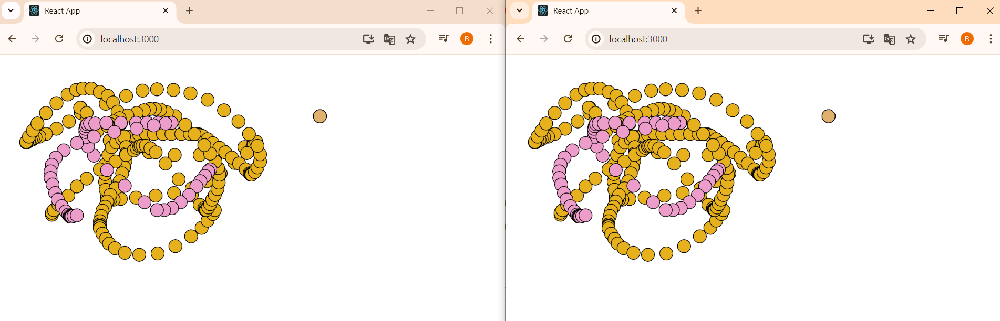
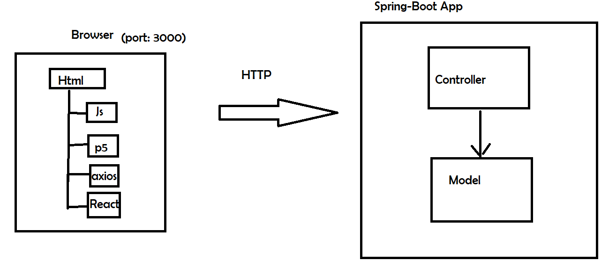

# MultiPlayerBoard

The project is a multiplayer drawing board consisting of two applications: one acts as the frontend and the other as the backend (API) built with Spring Boot. The backend has two endpoints: one (GET) returns a list of drawing actions, and the other (POST) receives a new drawing action and stores it. On the other hand, the frontend is developed in React JS, which graphically represents a board where users can draw circles repeatedly by clicking. Since it's multiplayer, it can run in multiple browsers simultaneously, allowing users to see real-time changes.

### Features
+ **Draw**: You can draw consecutive circles using the mouse click.


## Starting

In order to use the project on your system, you can access the following link and download a compressed file of it.

[Repository](https://github.com/Richi025/ARSW-MultiUserBoard.git) 

You can also clone the file using the following command.

```
git clone https://github.com/Richi025/ARSW-MultiUserBoard.git  
```

### Previous requirements

It is necessary to have "**Maven**", "**Java**", "**Node.js**" installed, preferably in their latest versions.

#### Maven
```
Download Maven at http://maven.apache.org/download.html 

Follow the instructions at http://maven.apache.org/download.html#Installation
```
#### Java

```
Download Java at https://www.java.com/es/download/ie_manual.jsp
```

#### Node.js

```
Download Node.js at https://nodejs.org/en
```

### Installing

Once you have the cloned project in your repository. Follow the steps below to launch the program successfully.

#### Run BackEnd Spring-boot

1. Open a terminal and enter the folder where I clone the repository and enter the BoardSpring folder.

2. Use the following command to compile and clean the target directory.
    ```
    mvn clean compile
    ```
3. Now use the following command to package the project as a JAR file.

    ```
    mvn package
    ```

4. Now you can run the project using the following command.

    ```
    mvn spring-boot:run

    Now the server is running.
    ```

#### Run FrontEnd React Js

1. Open a terminal and enter the folder where I clone the repository and enter the BoardReact folder.

2. Use the following command to install dependencies
    ```
    npm install
    ```
3. Now use the following command start proyect

    ```
    npm start
    ```

4. Now there will be a browser and enter the following link and you can start drawing.

    http://localhost:3000/ 

    

## Proyect Structure

### Run BackEnd Spring-boot

- BoardSpringApplication.java : Main application class for the Spring Boot application.

- Controller: MouseMovementController

   - REST controller for handling mouse movement data.

- Model: MouseMovement

    - Represents a mouse movement data object.

### Run FrontEnd React Js

#### App:

- Contains the global state of the application (actions and color).
- Renders ActionFetcher and Canvas, passing them necessary functions and data as props.

#### ActionFetcher:

- Uses useEffect to execute fetchActions() every second using setInterval.
- fetchActions() makes a GET request to the server to fetch drawing actions.
- Updates the actions state in App using setActions.

#### Canvas:

- Uses useRef to create references to containerRef (the canvas container) and p5InstanceRef (the p5 instance).
- Defines sketch to configure and draw on the canvas.
- useEffect initializes the p5 instance and associates it with containerRef when the component mounts.
- Another useEffect handles redrawing actions when actions change.
- drawAction draws a circle on the canvas based on received actions.

#### Server (API):

- There are two endpoints:
  - /mouse-movements (GET): Returns a list of drawing actions.
  - /mouse-movements (POST): Receives a new drawing action and stores it.


## Architectural Design



### Data Flow

#### Initialization:

- App mounts ActionFetcher and Canvas.
- ActionFetcher starts making GET requests to the server every second to update actions.

#### Drawing:

- When the user clicks on the canvas, Canvas creates a drawing action and sends it to the server via a POST request.
- drawAction in Canvas immediately draws the action.

#### Update:

- ActionFetcher periodically fetches actions from the server and updates the actions state in App.
- Whenever actions updates, Canvas clears and redraws all actions on the canvas.

## Built with

* [Maven](https://maven.apache.org/) - Dependency management
* [java](https://www.java.com/es/) - Programming language
* [Spring boot](https://start.spring.io/) - Framework

### Technologies Used
+ **Java:** Programming language.
+ **Spring Boot:** Framework for building the application.
+ **React:** Is an open source Javascript library designed for creating user interfaces.

## Versioned

We use [Git](https://github.com/) for version control. For available versions, see the tags in this repository.

## Authors

* **Jose Ricardo Vasquez Vega** - [Richi025](https://github.com/Richi025)

## Date

Friday, June 28, 2024

## License

This project is licensed under the GNU license; See the [LICENSE.txt](LICENSE.txt) file for details.